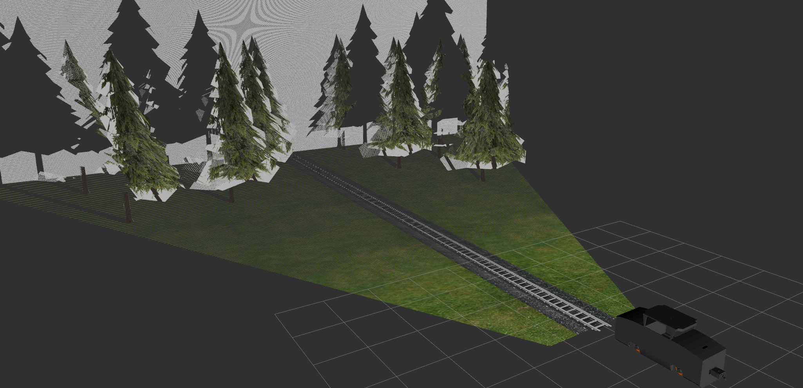

# <div align="center">Gazebo Train Simulation with Ros2</div>


<div align="center">
  <p>
  
   This is a project to simulate a train in gazebo. 

  </p>
</div>

<br />


# <div align="center">Install</div>

Clone the Repository: 
```bash
git clone https://github.com/Zerquer/ros2_gazebo_train.git
```

Install Dependencies and Build the Project
```bash
cd gazebo_train
. gazebo_train_install.sh
```

## <div align="center">Requirements</div>

In addition to the base ROS installation, the following additional ROS packages are required and are listed in the requirements.txt file.


<br/>
<br/>

# <div align="center">Launch the simulation</div>

### Environment simulation

<details>
<summary>Test World</summary>
<br />

Simulates an empty world consisting only of tracks
```
ros2 launch gazebo_train_gazebo gazebo_train.launch.py
```
<br />
</details>
<details>
<summary>Presentation World</summary>
<br />

Simulates a city -> can be used for presentation
```
ros2 launch gazebo_train_gazebo city_train.launch.py
```
<br />
</details>
<details>
<summary>KMAC World</summary>
<br />

Simulates the KMAC's rail vehicle laboratory.
```
ros2 launch gazebo_train_gazebo kmac_train.launch.py
```

<br />
</details>


<br />

# <div align="center">Features</div>

<details>
<summary>Control</summary>

<br />

The Gazebo_Train can be controlled via a GUI, a controller, or keyboard input. All control modes offer multiple speed levels and direction toggling. The controller node and keyboard node must be installed separately before use.  
By default, when installing the Gazebo_Train, the GUI is the active control interface and is automatically launched with the launch file. Each control method publishes velocity commands to the `/cmd_vel` topic. This topic is subscribed to by the Gazebo simulation and is directly connected to the train's drive wheels.

<details>
  <summary>GUI Control</summary>
  <br />

  

  The GUI-based control of the Gazebo_Train offers different speed levels, as well as start/stop functionality and direction toggling. When the **gazebo_train.launch.py** launch file is executed, the control node starts automatically and appears in the top-left corner of the screen. This makes the launch setup very portable and eliminates the need for a keyboard or controller.  
  To start the train, press the **Start** button, which will initiate a smooth and slow departure. For safe operation, it is strongly recommended to select the train speed in the given sequential order.
</details>
  <br/>

<details>
  <summary>Connecting a Controller</summary>
  <br />

  If you want to use a controller or keyboard instead of the GUI control, the corresponding node must be started when launching the Gazebo simulation.  
  It is also recommended to disable the GUI for this. To do so, go to the folder **/.../gazebo_train/src/gazebo_train_gazebo** and replace **line 46** with the following line:

  ```
  ##Node(package='gazebo_train_driver', executable='steuerung', name='steuerung', output='screen'),
  ```
  <br />

  Before starting the controller node, you need to install the **joy** package:

  ```
  sudo apt install ros-<your-distribution>-joy
  ```
  <br />

  Start the **joy_node**:

  ```
  ros2 run joy joy_node
  ```

  Then, in a new terminal, start the existing **teleop** node:

  ```
  ros2 run gazebo_train_driver teleop
  ```

  If everything is set up correctly, you should now be able to control the train using the controller.
</details>

<br />

<details>
  <summary>Connecting a Keyboard</summary>
  <br />

  If you want to use the keyboard instead of the GUI control, the corresponding node must be started when launching the Gazebo simulation.  
  It is also recommended to disable the GUI. To do this, go to the folder **/.../gazebo_train/src/gazebo_train_gazebo** and replace **line 46** with the following line:

  ```
   ##Node(package='gazebo_train_driver', executable='steuerung', name='steuerung', output='screen'),
  ```
  <br />

  Before starting the keyboard node, you need to install the **teleop-twist-keyboard** package:

  ```
  sudo apt install ros-&lt;your-distribution&gt;-teleop-twist-keyboard
  ```
  <br />

  Start the **teleop_twist_node** with:

  ```
  ros2 launch keystroke teleop_twist.launch.py
  ```

  No additional nodes are required since the **teleop_twist_node** converts keyboard input directly into the required Twist message.
</details>

<br/>
</details>

<details>
<summary>Ouster OS 1-32</summary>

<br />


The Ouster OS1-32 is a mid-range LiDAR sensor mounted on the roof of the train. It has a range of 120 meters, a vertical field of view of 45° (±22.5º), and a resolution of 655,360 points per second. The sensor parameters can be adjusted within the simulation environment.  

<br/>

To make the sensor visible in the simulation, set:
```
<visualize>true</visualize>
```
To keep the sensor permanently enabled in the simulation, set:
```
<always_on>true</always_on>
```
<br/>

You can modify the sensor properties as follows:
```
        <update_rate>5</update_rate>                # Change update rate in Hz
        <ray>
          <scan>
            <horizontal>
              <samples>360</samples>
              <resolution>1.000000</resolution>     # Change angular resolution
              <min_angle>0.000000</min_angle>       # Change start angle
              <max_angle>6.280000</max_angle>       # Change end angle
            </horizontal>
          </scan>
          <range>
            <min>1</min>                            # Change minimum scan range
            <max>12</max>                           # Change maximum scan range
            <resolution>0.015000</resolution>       # Change scan range resolution
          </range>
```
<br/>

Sensor data can be accessed with the following command:  
```
ros2 topic echo /scan
```
<br />

More information about the Gazebo plugin: [**Lidar Gazebo**](https://classic.gazebosim.org/tutorials?tut=ros_gzplugins#GPULaser)  
More information about the sensor: [**Ouster**](https://ouster.com/products/scanning-lidar/os1-sensor/)  
<br /><br />
<br />

</details>

<details>
<summary>Stereolabs ZED</summary>

<br />


The ZED2 is a high-resolution 3D video camera mounted centrally at the front tip of the train. With a pixel size of 2μm x 2μm and a field of view up to 110°(H) x 70°(V) x 120°(D) plus neural depth perception of the environment, it is excellently suited for use on the train.  
The sensor parameters can be adjusted within the simulation environment.

<br />


To make the sensor visible in the simulation:  
```
<visualize>true</visualize>
```
To keep the sensor permanently enabled in the simulation:  
```
<always_on>true</always_on>
```
<br/>

Modify sensor properties:  
```
<sensor name="zed2i_depth" type="depth">
  <always_on>1</always_on>                    <!-- Sensor is always active -->
  <update_rate>1</update_rate>                <!-- Sensor update rate in Hz -->
  <pose>0.022 -0.8 0.6 0 0 -1.571</pose>    <!-- Sensor pose (position and orientation) -->
  <camera name="realsense_depth_camera">
    <horizontal_fov>1.02974</horizontal_fov>  <!-- Horizontal field of view in radians -->
    <image>
      <width>1920</width>                     <!-- Image width -->
      <height>1080</height>                   <!-- Image height -->
      <format>B8R8G8</format>                 <!-- Image format (color channel order) -->
    </image>
    <clip>
      <near>0.02</near>                       <!-- Minimum detection distance -->
      <far>20</far>                           <!-- Maximum detection distance -->
    </clip>
    <noise>
      <type>gaussian</type>                   <!-- Sensor noise type (Gaussian noise) -->
      <mean>0.0</mean>                        <!-- Noise mean -->
      <stddev>0.007</stddev>                  <!-- Noise standard deviation -->
    </noise>
  </camera>
  <plugin name="zed2i_depth_driver" filename="libgazebo_ros_camera.so">
    <ros>
    </ros>
    <camera_name>zed2i_depth</camera_name>     <!-- Camera name in ROS -->
    <frame_name>camera_lens_link</frame_name>  <!-- Frame name for the camera -->
    <hack_baseline>0.07</hack_baseline>        <!-- Stereo baseline hack -->
    <min_depth>0.001</min_depth>               <!-- Minimum depth measurement -->
    <max_depth>100</max_depth>                 <!-- Maximum depth measurement -->
  </plugin>
</sensor>


```
<br/>

Sensor data can be accessed with:
```
ros2 topic echo /camera/image_raw
```
or visualized directly with:
```
ros2 run rqt_image_view rqt_image_view 
```
<br/>

RViz Configuration

It is also possible to output a point cloud from the stereo camera. To do this, subscribe to the image topic `/zed2i_depth/depth/image_raw` and the pointcloud2 topic `/zed2i_depth/points`.
The output should look like the image below.

A template for the RViz configuration can be found here: [**rviz-file**](/src/gazebo_train_gazebo/rviz/) 


<br />

More information about the Gazebo plugin: [**Camera Gazebo**](https://classic.gazebosim.org/tutorials?tut=ros_gzplugins#Camera)
<br />

More information about the sensor: [**Stereolabs**](https://www.stereolabs.com/zed-2/)
<br />
<br />
</details>

<details>
  <summary>IMU</summary>

  <br />

  The IMU (Inertial Measurement Unit) sensor measures acceleration, angular velocity, and the orientation of the model. It is located at the center of the train but is not visually represented in the simulation. Thanks to the use of <a href="https://en.wikipedia.org/wiki/Odometry"><strong>odometry</strong></a>, the train can estimate its pose (position and orientation) in space. When combined with the visual sensors, this allows for highly accurate localization.

  <br />

  Sensor data can be accessed using the following command:
  <br />
  ```
  ros2 topic echo /imu</code>
  ```
  <br />

  More information about the Gazebo plugin: 
  <a href="https://classic.gazebosim.org/tutorials?tut=ros_gzplugins#IMU(GazeboRosImu)">
    <strong>Gazebo IMU</strong>
  </a>

  <br /><br />
</details>
<br />

# <div align="center">Environments</div>

<div align="center">
  <a href = "https://code.visualstudio.com/" style="text-decoration:none;">
    </a>
  <a href = "https://www.python.org/" style="text-decoration:none;">
    </a>
  <a href = "https://isocpp.org/" style="text-decoration:none;">
    </a>
  <a href = "https://docs.ros.org/en/foxy/index.html" style="text-decoration:none;">
    </a>
  <a href = "https://about.gitlab.com/" style="text-decoration:none;">
    </a>
  <a href = "https://ubuntu.com/" style="text-decoration:none;">
    </a>
  <a href = "http://sdformat.org/" style="text-decoration:none;">
    </a>
</div>

<br /> 
<br /> 

# <div align="center">Contact</div>

For business inquiries or professional support requests please visit 
<br>
<div align="center">
    
  <a href="https://git.fh-aachen.de/lf4943s" style="text-decoration:none;">
    </a>
  
  <a href="https://www.linkedin.com/in/luigi-ferraioli-850554250/"  style="text-decoration:none;">
    </a>
    

</div>
