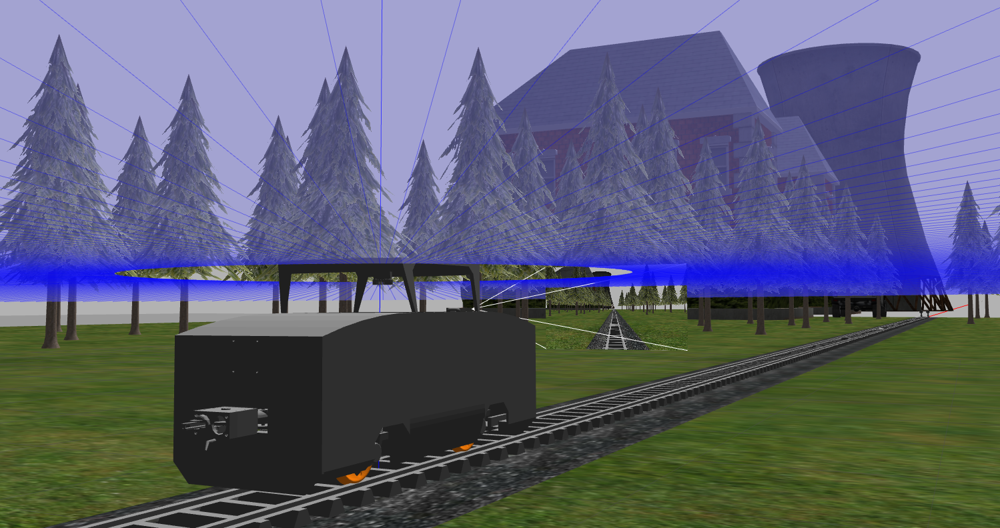
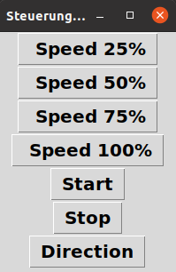
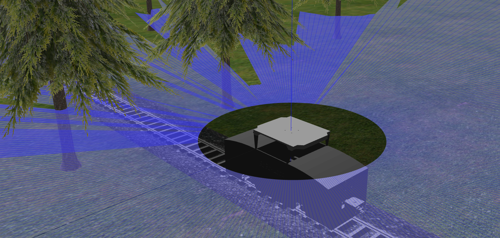
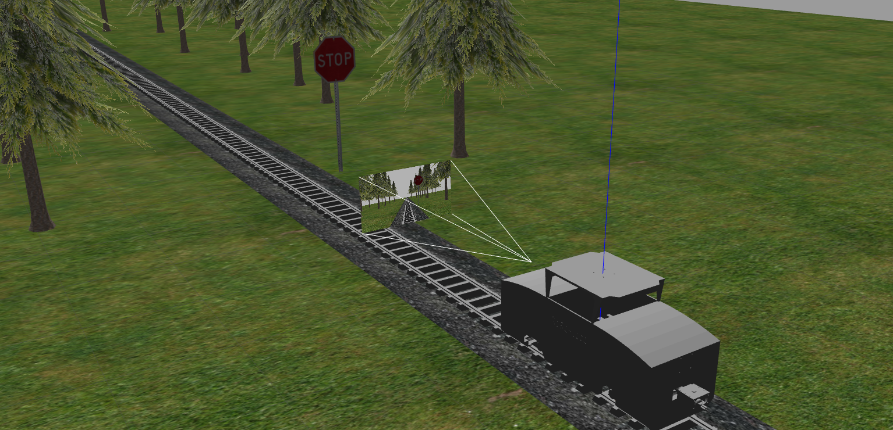
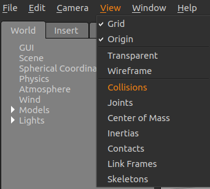

# <div align="center">Gazebo Train Simulation with Ros2</div>


<div align="center">
  <p>
  
   This is a student project to simulate a train in gazebo. Based on an already existing project, ros2 was integrated to control the train. The train was also equipped with two sensors Ouster OS1-32 and Stereolabs ZED.
  </p>
</div>

<br />




# <div align="center">Install</div>

Clone the Repository 
```
git clone https://git.fh-aachen.de/lf4943s/gazebo_train.git
```
Enter your FH-ID and password

```
cd gazebo_train
rosdep install --from-paths src --ignore-src -r -y
colcon build
source install/setup.bash
```
<br />

# <div align="center">Launch the simulation</div>

## Launch the Gazebo_Train_Simulation

```
ros2 launch gazebo_train_gazebo gazebo_train.launch.py
```
<br />

## Launch the Gazebo_Train_Simulation for a Presentation

```
ros2 launch gazebo_train_gazebo city_train.launch.py
```
<br />
<br />

# <div align="center">Features</div>

<details>
<summary>Steuerung</summary>

<br />

  Die Steuerung des Gazebo_Trains erfolgt über ein GUI, einen Controller oder die Tastertureingabe. Alle Steuerungen beinhalten verschiedene Geschwindigkeitsstufen und eine Richtungsänderung. Die Controller-Node und die Keyboard-Node müssen vor der Benutzung noch installiert werden.
  Standardmäßig ist beim Installieren des Gazebo_Trains das GUI als Steuerung aktiviert, welches zusammen mit der Launch-Datei automatisch startet. Jede dieser Steuerungen publisht seine Daten auf das Topic **/cmd_vel**. Dieses Topic wiederrum wird von der Gazebosimulation subscribt und ist unmittelbar mit den Zugrädern verknüpft.

  <details>
  <summary>GUI Steuerung</summary>
  <br /> 

  

  Die Steuerung des Gazebo_Trains über das GUI beinhaltet verschiedene Geschwindigkeitsstufen, sowie eine Start-Stop Funktion und eine Richtungsänderung. Wird die Launchdatei **gazebo_train.launch.py** gestartet, startet automatisch die Steuerungsnode und erscheint am linken oberen Eck des Bildschirms. Somit ist die Launch sehr portabel und es wird weder eine Tastatur noch ein Controller benötigt. Um den Zug zu starten drückt man den **Start** Button, welcher den Zug mit geringer Geschwindigkeit anfahren lässt. Um eine sichere Fahrt zu gewährleisten wird stets empfohlen die Zuggeschwindigkeit in der vorgegebenen Reihenfolge zu wählen. 


  <br />
  <details>
  <summary>GUI Quellcode</summary>
  <br /> 

  Die Steuerung kann beliebig erweitert oder modifiziert werden. Die Geschwindigkeit wird jeweils mit dem Factor 1.0 multipliziert, somit ist die Maximalgeschwindigkeit des Zuges bei der Funktion **fspeed100()** bei 1.2. Es ist durchaus möglich den Zug auch schneller fahren zu lassen, allerdings wird dieser dann instabiler und die Möglichkeit einer Entgleisung besteht. Ohne Sesnoren konnte der Zug nach unseren Tests bis zu 3.0 facher Geschwindigkeit fahren ohne zu entgleisen. Durch Anbringung der Sensoren verlagert sich der Schwerpunkt sowie die Trägheit, was bei zu schneller Geschwindigkeit zum Ausbrechen des Zuges führen kann. Die Funktion **fstart()** setzt den Zug mit einer Geschwindigkeit < 10% in Bewegung, um einen sicheren Start zu gewährleisten. Es ist zu beachten, dass der Zug stets nur in eine Richtung gestartet werden kann. Die Funktion **fstop()** setzt alle möglichen Koordinatenrichtungen auf 0.0 zurück. Die Funktionen **fdirektion()** und **fgetdirektion()** ändern jeweils das Vorzeichen der Geschwindigkeit. Um die Richtung zu ändern wird zuerst **"Direction"** und im Anschluss die gewünschte Geschwindigkeit ausgewählt. Hierbei ist zu empfehlen stets mit einer niedrigen Geschwindigkeit zu beginnen.

  ```
  def fspeed25():
      print("Geschwindigkeit = 25%")               # Ausgabe im Terminal -> erst beim Schließen des Terminals sichtbar
      speed_scale = 0.3
      cmd.linear.x = speed_scale * direktion
      self.pub.publish(cmd)

  def fspeed50():
      printnt("Geschwindigkeit = 50%")             
      speed_scale = 0.6                            # Factor der Funktion
      cmd.linear.x = speed_scale * direktion
      self.pub.publish(cmd)

  def fspeed75():
      print("Geschwindigkeit = 75%")               
      speed_scale = 0.9                            
      cmd.linear.x = speed_scale * direktion       # Speichert das Produkt der Multiplikation unter der Variablen cmd.linear.x 
      self.pub.publish(cmd)

  def fspeed100():
      print("Geschwindigkeit = 100%")              
      speed_scale = 1.2
      cmd.linear.x = speed_scale * direktion
      self.pub.publish(cmd)                        # Publishen des Variablenwertes an /cmd_vel

  def fstart():
      print("Start wird eingeleitet")              
      speed_scale = 0.1
      getdirektion()
      cmd.linear.x = speed_scale * direktion
      self.pub.publish(cmd)                        

  def fstop():
      print("STOP -> Keine Beschleunigung")        
      cmd = Twist()
      cmd.linear.x = 0.0                           # Setzt cmd.linear und cmd.angular zurück auf 0.0
      cmd.linear.y = 0.0
      cmd.linear.z = 0.0
      cmd.angular.x = 0.0
      cmd.angular.y = 0.0
      cmd.angular.z = 0.0
      self.pub.publish(cmd)                        # Publishen der eingestellten Daten an /cmd_vel
        
  def fdirektion():
      print("Richtungsänderung")                   # Ausgabe im Terminal -> erst beim Schließen des Terminals sichtbar
      global counter
      global direktion
      counter += 1

      if counter==1:
          direktion = -1
      if counter==2:
          direktion = 1
          counter = 0

  def fgetdirektion():
      global direktion     
      direktion = 1
  ```
  **/.../gazebo_train/src/gazebo_train_driver/steuerung.py**

  <br/>

  Für mehr Informationen zum erstellen eines GUI: [**TKinter**](https://docs.python.org/3/library/tkinter.html)

  </details>
  </details>
  <br />

  <details>
  <summary>Verbinden eines Controllers</summary>
  <br /> 
  
  Falls Anstelle der GUI- Steuerung ein Controller oder ein Keyboard verwendet wird, muss die entsprechende Node beim Launchen der Gazebo-Simulation gestartet werden. 
  Weiterhin empfiehlt es sich die GUI auszuschalten, hierfür in den Ordner **/.../gazebo_train/src/gazebo_train_gazebo** und **Zeile 46** durch den folgenden Ausdruck ersetzten.


  ```
   ##Node(package='gazebo_train_driver',executable='steuerung',name='steuerung',output='screen'),
  ```
  <br /> 

  Zum Starten der Controller-Node muss zunächst das **joy** package heruntergeladen werden.

  ```  
  sudo apt install ros-(ihre Distribution)-joy
  ```
  <br /> 
  
  Starten der **joy_node**
  ```  
  ros2 run joy joy_node
  ```
  In einem neuen Terminal die bereits vorhandene **Teleop** starten
  ```  
  ros2 run gazebo_train_driver teleop
  ```
  Wenn alles richtig gemacht wurde, sollte der Zug nun auch mit dem Controller bedienbar sein.
  </details>

<br />

  <details>
  <summary>Verbinden eines Keyboards</summary>
  <br /> 
  
  Falls Anstelle der GUI-Steuerung das Keyboard verwendet werden soll, muss die entsprechende Node beim Launchen der Gazebo-Simulation gestartet werden. 
  Weiterhin empfiehlt es sich die GUI auszuschalten, hierfür in den Ordner **/.../gazebo_train/src/gazebo_train_gazebo** und **Zeile 46** durch den folgenden Ausdruck ersetzten.


  ```
   ##Node(package='gazebo_train_driver',executable='steuerung',name='steuerung',output='screen'),
  ```
  <br /> 

  Zum Starten der Keyboard-Node muss zunächst das **teleop-twist-keyboard** package heruntergeladen werden.

  ```  
  sudo apt install ros-(ihre Distribution))-teleop-twist-keyboard
  ```
  <br /> 
  
  Starten der **telop_twist_node**
  ```  
  ros2 launch keystroke telop_twist.launch.py
  ```
  Eine weitere Node ist nicht nötig, da die **telop_twist_node** die Eingabe direkt in die benötigte Twist-Message umwandelt.


</details>
<br/>

  <details>
  <summary>Schnittstelle Antrieb</summary>
  <br /> 
  
  Die Eigenschaften des Antriebs verändern
  ```
    <plugin name="train_diff_drive" filename="libgazebo_ros_diff_drive.so">

      <ros>
      </ros>

      <update_rate>30</update_rate>                         #Änderung der Updaterate in Hz

      <!-- wheels -->
      <left_joint>wheel_left_joint</left_joint>             #Änderung der Antriebsgelenke
      <right_joint>wheel_right_joint</right_joint>          #Änderung der Antriebsgelenke


      <!-- kinematics -->
      <wheel_separation>0.287</wheel_separation>            #Änderung der Spurweite in Meter
      <wheel_diameter>0.066</wheel_diameter>                #Änderung des Raddurchmessers

      <!-- limits -->
      <max_wheel_torque>60</max_wheel_torque>               #Änderung des maximalen Drehmoments
      <max_wheel_acceleration>2.0</max_wheel_acceleration>  #Änderung der maximalen Beschleunigung

      <command_topic>cmd_vel</command_topic>

      <!-- output -->
      <publish_odom>true</publish_odom>                     #Publishen der Odometrie
      <publish_odom_tf>true</publish_odom_tf>               #Publishen des Odometrie Koordinatensystems
      <publish_wheel_tf>false</publish_wheel_tf>            #Publishen des Koordinatensystems der Räder

      <odometry_topic>odom</odometry_topic>
      <odometry_frame>odom</odometry_frame>
      <robot_base_frame>base_footprint</robot_base_frame>

    </plugin>
  ```
  Werte, die nicht aufgeführt sind, werden defaultmäßig bestimmt. Z.B.:
  ```
  <!-- Topic to receive geometry_msgs/Twist message commands, defaults to `cmd_vel` -->
  <commandTopic>cmd_vel</commandTopic>
  ```
  <br />

  Mehr Informationen zum Gazbeo-Plugin: [**Differential Drive Gazebo**](https://classic.gazebosim.org/tutorials?tut=ros_gzplugins#DifferentialDrive)

</details>
<br/>
</details>

<details>
<summary>Ouster OS 1-32</summary>

<br />



Der Ouster OS 1-32 ist ein mid-range Lidar Sensor, welcher am Dach des Zuges befestigt ist. Dieser hat eine Reichweite von 120m, eine Vertical Field of View von 45° (±22.5º) und eine Auflösung von 655,360 Punkten pro Sekunde. Es besteht die Möglichkeit die Parameter des Sensors in der Simulationsumgebung umzustellen.
<br/>

Den Sensor in der Simulation sichtbar machen
```
<visualize>true</visualize>
```
Den Sensor in der Simulation dauerhaft an schalten
```
<always_on>true</always_on>
```
<br/>

Die Sensoreigenschaften verändern
```
        <update_rate>5</update_rate>                #Änderung der Updaterate in Hz
        <ray>
          <scan>
            <horizontal>
              <samples>360</samples>
              <resolution>1.000000</resolution>     #Änderung der Winkelauflösung
              <min_angle>0.000000</min_angle>       #Änderung des Startwinkels
              <max_angle>6.280000</max_angle>       #Änderung des Endwinkels
            </horizontal>
          </scan>
          <range>
            <min>1</min>                            #Änderung der minimalen Scanreichweite
            <max>12</max>                           #Änderung der maximalen Scanreichweite
            <resolution>0.015000</resolution>       #Änderung der Scanreichweitenauflösung
          </range>
```
<br/>

Die Sensordaten können mit folgendem Befehl aufgerufen werden. 
```
ros2 topic echo /scan
```
<br />

Mehr Informationen zum Gazbeo-Plugin: [**Lidar Gazebo**](https://classic.gazebosim.org/tutorials?tut=ros_gzplugins#GPULaser)
<br />

Mehr Informationen zum Sensor: [**Ouster**](https://ouster.com/products/scanning-lidar/os1-sensor/)
<br />
<br />

</details>

<details>
<summary>Stereolabs ZED</summary>

<br />



Die ZED2 ist eine hochauflösendes 3D-Videocamera die mittig an der Spitze des Zuges befestigt ist. Mit einer Pixelgröße 2μm x 2μm und einer Field od View von Max. 110°(H) x 70°(V) x 120°(D) und neuronale Tiefenwahrnehmung der Umgebung, ist diese herrvorragend für den Einsatz am Train geeignet.
Es besteht die Möglichkeit die Parameter des Sensors in der Simulationsumgebung umzustellen.

Den Sensor in der Simulation sichtbar machen
```
<visualize>true</visualize>
```
Den Sensor in der Simulation dauerhaft anschalten
```
<always_on>true</always_on>
```
<br/>

Die Sensoreigenschaften verändern
```
        <update_rate>30</update_rate>                 #Änderung der Updaterate in Hz
        <pose>0.022 -0.8 0.6 0 0 -1.571</pose>        #Änderung der Orientierung im Raum
        <camera name="intel_realsense_r200">          #Änderung des Cameranamens
          <horizontal_fov>1.02974</horizontal_fov>
          <image>
            <width>1920</width>                       #Änderung der Cameraauflösung
            <height>1080</height>                     #Änderung der Cameraauflösung
            <format>R8G8B8</format>                   #Änderung des Farbraumes
          </image>
          <clip>
            <near>0.02</near>                         #Änderung der minimalen Erkennungsdistanz
            <far>300</far>                            #Änderung der maximalen Erkennungsdistanz
          </clip>
```
<br/>

Die Sensordaten können mit folgendem Befehl aufgerufen werden.
```
ros2 topic echo /camera/image_raw
```
oder alternativ direkt visualisiert werden
```
ros2 run rqt_image_view rqt_image_view 
```

<br />

Mehr Informationen zum Gazbeo-Plugin: [**Camera Gazebo**](https://classic.gazebosim.org/tutorials?tut=ros_gzplugins#Camera)
<br />
<br />

Mehr Informationen zum Sensor: [**Stereolabs**](https://www.stereolabs.com/zed-2/)
<br />
<br />
</details>

<details>
<summary>IMU</summary>

<br />

Der IMU-Sensor (Inertial Measurement Unit) misst die Beschleunigung, die Winkelgeschwindigkeit und die Orientierung des Modells. Dieser befindet sich im Zentrum und ist in der Simulation nicht dargestellt. Aufgrund der [**Odometrie**](https://de.wikipedia.org/wiki/Odometrie) kann der Zug seine Pose im Raum (Position und Orientierung) schätzen. Kombiniert man dies mit den optischen Sensoren ist eine sehr genaue Lagebestimmung möglich. 
<br/>

Die Sensordaten können mit folgendem Befehl aufgerufen werden.
```
ros2 topic echo /imu
```
<br />
<br />

Mehr Informationen zum Gazbeo-Plugin: [**Gazebo IMU**](https://classic.gazebosim.org/tutorials?tut=ros_gzplugins#IMU(GazeboRosImu))

<br />
<br />
</details>


<br />

# <div align="center">Nützliche Befehle</div>

  <details>
  <summary>ROS2 Commands</summary>
  <br /> 

   Übersicht über nützliche Befehle als PDF [**ROS2 Cheats Sheet**](https://github.com/ubuntu-robotics/ros2_cheats_sheet/blob/master/cli/cli_cheats_sheet.pdf)  

  Weiterhin hilfreich zweimaliges Betätigen der Tabulatortaste um die möglichen Eingabebefehle aufzulisten
  <br />

  Gibt eine Auflistung aller aktiven Topics zurück
  Visualisierung der Daten des Topics
  ```
  ros2 topic echo /(Topicname)
  ```
  Gibt den Type, die Anzahl der Publisher und Subscriber an
  ```
  ros2 topic info /(Topicname)
  ```


  Mehr Informationen zu Nodes : [**ROS2 Understanding Topics**](https://docs.ros.org/en/foxy/Tutorials/Beginner-CLI-Tools/Understanding-ROS2-Topics/Understanding-ROS2-Topics.html)

  <br />

  Gibt eine Auflistung aller aktiven Nodes zurück
  ```
  ros2 node list
  ```
  Gibt an, ob es sich um ein Topic, Action oder Service handelt und Daten versandt werden
  ```
  ros2 node info /(Nodename)
  ```

  Mehr Informationen zu Nodes : [**ROS2 Understanding Nodes**](https://docs.ros.org/en/foxy/Tutorials/Beginner-CLI-Tools/Understanding-ROS2-Nodes/Understanding-ROS2-Nodes.html#)

  <br />

  ### RVIZ

  RVIZ ist eine grafische Benutzeroberfläche von ROS, mit der Sie viele Informationen visualisieren können.
  Mit dem Reiter **add** > **By topic** können einkommende Topics der Visualisierung hinzufügen 

  Zum Starten des 3D visualization tool for ROS2. Stellen Sie sicher, dass Sie **rviz2** installiert haben
  ```
  ros2 run rviz2 rviz2
  ```
  <br />

  ### RQT

  RQt ist ein Framework für grafische Benutzeroberflächen, das verschiedene Tools und Schnittstellen in Form von Plugins implementiert.

  Stellen Sie sicher, dass Sie **rqt** installiert haben

  <br />

  Zum Visualisieren der Topics und Verknüpfungen
  ```
  ros2 run rqt_graph rqt_graph 
  ```
  Zum subscriben des Topics **/camera/image_raw** und zum visualisieren der Camera
  ```
  ros2 run rqt_image_view rqt_image_view 
  ```

  Mehr Informationen zu Nodes : [**ROS2 Understanding RQT**](https://docs.ros.org/en/foxy/Concepts/About-RQt.html)


  <br />
  </details>
  <details>
  <summary>Gazebo Commands</summary>
  <br />
  
  

  - Transparent    : Display models as transparent
  - Wireframe      : Display models as wireframe
  - Collision      : Display model collision
  - Joints         : Display joints of all links
  - Center of Mass : Display center of mass
  - Inertias       : Display Inertias of all links
  - Contacts       : Display Contakt with other models
  - Link Frames    : Display coordinare frames for links

  <br />

  Mehr Informationen zu Gazebo: [**Gazebo**](https://classic.gazebosim.org/) 

  <br />
  </details>

  <details>
  <summary>SDF and URDF Commands</summary>


  <br />


  Wandelt eine URDF-Datei in eine SDF-Datei um
  ```
  gz sdf -p /my_urdf.urdf > /my_sdf.sdf
  ```
  Erzeugt eine PDF-Datei mit den Links und Joints und deren Orientierung
  ```
  urdf_to_graphiz /my_urdf.urdf
  ```
  Schnelle Erzeugung eines neuen Modells für Tests

  ```
  <?xml version='1.0'?>
  <sdf version='1.7'>
    <model name='XXX'>
      <link name='link_1'>
        <visual name='visual'>
          <geometry>
            <mesh>
              <uri>model://XXX/meshes/XXX.stl</uri>
              <scale>0.001 0.001 0.001</scale>
            </mesh>
          </geometry>
        </visual>
        <collision name='collision'>
          <geometry>
            <mesh>
              <uri>model://map_1/meshes/map_1.stl</uri>
            </mesh>
          </geometry>
        </collision>
      </link>
    </model>
  </sdf>
  ```
  <br />

  Mehr Informationen zu SDF-Files: [**SDFormat**](http://sdformat.org/) 

  <br />
  </details>

# <div align="center">Fehlerbehebung</div>

<br />
  <details>
  <summary>Löschen der  log, build und install Ordner </summary>

  <br />

  Falls die **log/**, **build/** und **install/** Ordner geschlöscht werden sollten, muss der **urdf** und der **mesh** Ordner aus dem **/.../gazebo_train/src/gazebo_train_description/** in den **/.../gazebo_train/install/gazebo_train_description/share/gazebo_train_description** Ordner kopiert werden. Dies geschieht leider nicht automatisch beim **builden** und konnte nicht behoben werden.

  <br />
  </details>

<br />
<br />

# <div align="center">Environments</div>

<div align="center">
  <a href = "https://code.visualstudio.com/" style="text-decoration:none;">
    </a>
  <a href = "https://www.python.org/" style="text-decoration:none;">
    </a>
  <a href = "https://isocpp.org/" style="text-decoration:none;">
    </a>
  <a href = "https://docs.ros.org/en/foxy/index.html" style="text-decoration:none;">
    </a>
  <a href = "https://gazebosim.org/home" style="text-decoration:none;">
    </a>
  <a href = "https://about.gitlab.com/" style="text-decoration:none;">
    </a>
  <a href = "https://ubuntu.com/" style="text-decoration:none;">
    </a>
  <a href = "http://sdformat.org/" style="text-decoration:none;">
    </a>
</div>


<br /> 
<br /> 

 
# <div align="center">Contact</div>

For business inquiries or professional support requests please visit 
<br>
<div align="center">
  <a href="https://git.fh-aachen.de/dd5862s" style="text-decoration:none;">
    </a>
  
  <a href="https://de.linkedin.com/in/david-dembski-b4154520a/en?trk=people-guest_people_search-card" style="text-decoration:none;">
    </a>
  
  <a href="https://www.instagram.com/dembski97/" style="text-decoration:none;">
    </a>
    
  <a href="https://git.fh-aachen.de/lf4943s" style="text-decoration:none;">
    </a>
  
  <a href="https://www.linkedin.com/in/luigi-ferraioli-850554250/"  style="text-decoration:none;">
    </a>
  
  <a href="https://www.instagram.com/_luigi_21/" style="text-decoration:none;">
    </a>
    

</div>